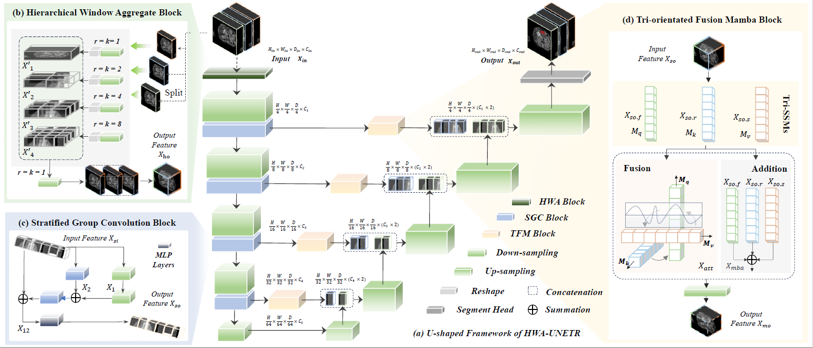

# Hierarchical Window Aggregate UNETR for 3D Multimodal Gastric Lesion Segmentation

🎉 This work is provisional accepted by [MICCAI 2025](https://conferences.miccai.org/2025/en/default.asp) !

## Authors
Jiaming Liang, 
Lihuan Dai, 
Xiaoqi Sheng, 
Xiangguang Chen, 
Chun Yao, 
Guihua Tao, 
Qibin Leng, 
Honming, 
Xi Zhong



## How to run this code
All of the following operations must be entered in the operating system's command line.

### get project
```
git clone git@github.com:JeMing-creater/HWA-UNETR.git
```

### environment install
```
cd requirements

# Mamba base environment
cd Mamba/causal-conv1d
python setup.py install
cd Mamba/mamba
python setup.py install
# TFM method setting
# Find the mamba_sample.py file and replace it with requirements\mamba_sample.py

# other environment requirements
cd requirements
pip install -r requirements.txt
```
### training
single GPU training
```
python3 train_seg_GCM.py
```
multi GPUs training. User can change GPU setting in train.sh. 
```
sh train.sh
```


# Data Description
## New dataset:  GCM 2025
Dataset Name: Gastric Cancer MRI, GCM 2025

Modality: MRI

Size: 500 3D volumes (400 Training + 100 Validation)

- Download the official GCM 2025 dataset from the link below and place it into "TrainingData" in the dataset folder: <br>
    通过网盘分享的文件：GCM 2025<br>
    链接: https://pan.baidu.com/s/1ZxxGyaMb4CJlZH5bDSqHJw?pwd=gcmm 提取码: gcmm

GCM 2025 includes three types of MRI stomach scans along with their corresponding professional annotations for tumors: fat-suppressed T2-weighted (FS-T2W), apparent diffusion coefficient (ADC), and venous phase contrast-enhanced T1-weighted (CE-T1W). Challengers need to integrate and utilize the modal information to achieve precise lesion segmentation.

**Data Acquisition Criteria**: The technical scanning parameters for all data samples in the GCM 2025 dataset are comprehensively summarized in the following table:<br>


**Data Acquisition Criteria**: The acquisition criteria of GCM 2025 dataset are as follows: (a) histopathologically confirmed gastric cancer; (b) preoperative MRI within 2 weeks prior to surgery; (c) with no history of other malignancies. Exclusion criteria comprised: (a) suboptimal image quality and (b) tumor lesion size too small to be segmented. <br>

## publicly BraTS2021

Modality: MRI

Size: 1470 3D volumes (1251 Training + 219 Validation)

Challenge: RSNA-ASNR-MICCAI Brain Tumor Segmentation (BraTS) Challenge

- Register and download the official BraTS 21 dataset from the link below and place them into "TrainingData" in the dataset folder:

  https://www.synapse.org/#!Synapse:syn27046444/wiki/616992

The sub-regions considered for evaluation in BraTS 21 challenge are the "enhancing tumor" (ET), the "tumor core" (TC), and the "whole tumor" (WT). The ET is described by areas that show hyper-intensity in T1Gd when compared to T1, but also when compared to “healthy” white matter in T1Gd. The TC describes the bulk of the tumor, which is what is typically resected. The TC entails the ET, as well as the necrotic (NCR) parts of the tumor. The appearance of NCR is typically hypo-intense in T1-Gd when compared to T1. The WT describes the complete extent of the disease, as it entails the TC and the peritumoral edematous/invaded tissue (ED), which is typically depicted by hyper-intense signal in FLAIR [[BraTS 21]](http://braintumorsegmentation.org/).

# Experiments


# Visual Comparisons 


